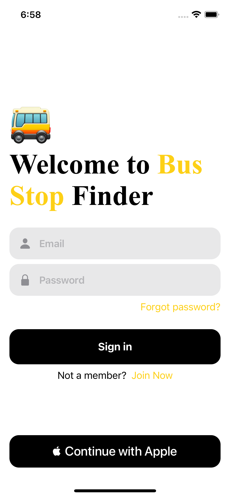
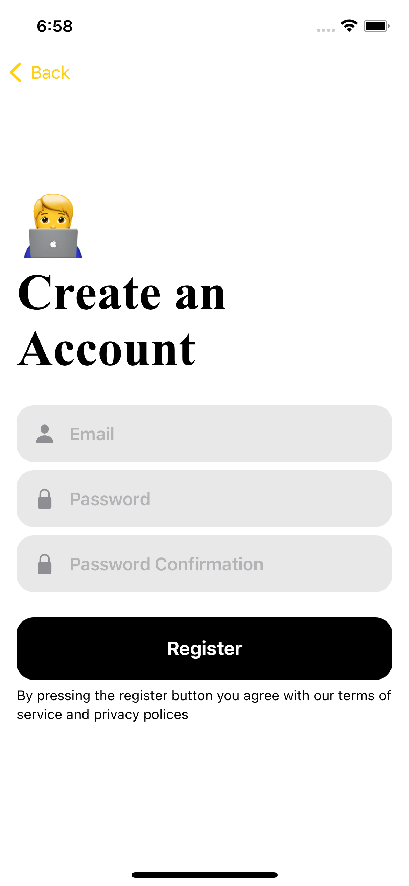
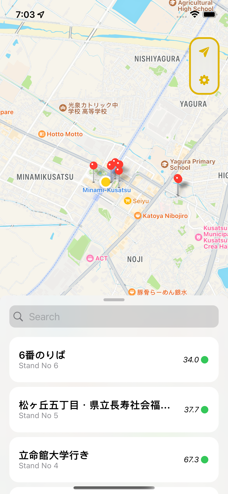
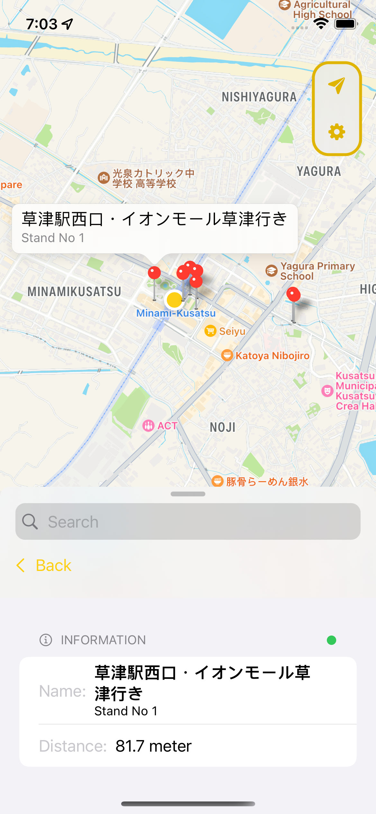
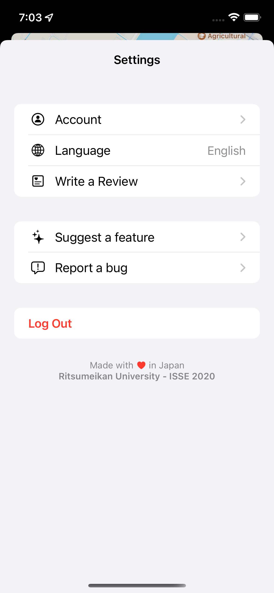

# Bus Stop Finder

The bus stop app is a simple app that allows you to find the nearest bus stop to your location and shows the bus stop's name, distance and longitude and latitude.

## 📱 Screenshots

| Login  | Sign up   | Map    | Pins  | Settings  |
| ------------ | ------------ | ------------ | -------------- | ----------- |
|  |  |  |  |  |

## 🧙‍♂️ Features

* Uses Firebase for authentication, database and analytics
* Built for iOS, iPadOS and macOS
* Written in SwiftUI
* Dark mode support
* Support for English, Japanese, Hindi and Indonesian
* iOS 14.0+
* License: [GPLv3](https://github.com/agamsanghera/bus-stop-finder?tab=GPL-3.0-1-ov-file)

## 🤳 Download

App Store: Under review

## 🛠 Build our App

To build the App, please build the app through Xcode

## 🇪🇺 Translate

The App is translated in English, Japanese, Hindi and Indonesian. If there is a translation you would like to contribute, please open an issue.

## Contributors
@agamsanghera
